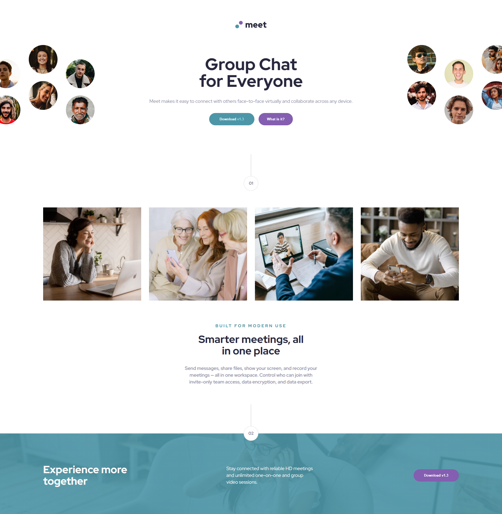

# Frontend Mentor - Meet landing page solution

This is a solution to the [Meet landing page challenge on Frontend Mentor](https://www.frontendmentor.io/solutions/responsive-landing-page-using-css-flexbox--O02mtC0e). Frontend Mentor challenges help you improve your coding skills by building realistic projects.

## Table of contents

- [Frontend Mentor - Meet landing page solution](#frontend-mentor---meet-landing-page-solution)
  - [Table of contents](#table-of-contents)
  - [Overview](#overview)
    - [The challenge](#the-challenge)
    - [Screenshot](#screenshot)
    - [Links](#links)
  - [My process](#my-process)
    - [Built with](#built-with)
    - [What I learned](#what-i-learned)
  - [Author](#author)

## Overview

### The challenge

Users should be able to:

- View the optimal layout depending on their device's screen size
- See hover states for interactive elements

### Screenshot

### Links

- Solution URL: [Visit](https://github.com/KhoiNgD/meeting-landing-page)
- Live Site URL: [Visit](https://khoind-meeting.netlify.app)

## My process

### Built with

- Semantic HTML5 markup
- CSS custom properties
- Flexbox
- Desktop-first workflow

### What I learned

- Responsive image in Flex layout
- Using fluid typography
- Combine background image with overlay using css

## Author

- Website - Not Yet
- Frontend Mentor - [@KhoiNgD](https://www.frontendmentor.io/profile/KhoiNgD)
